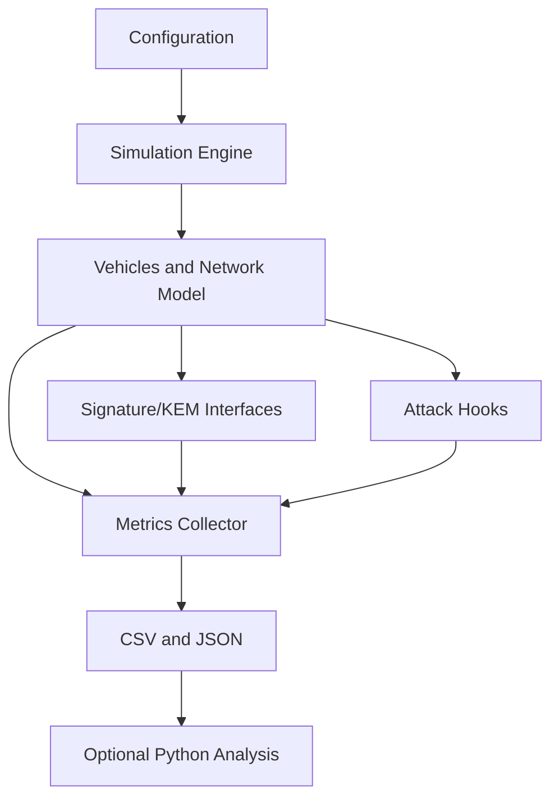

# PQC V2X Research Simulator

A modular C++ simulator for studying post-quantum authentication overhead in V2V and V2I communication. Vehicles generate signed CAM-style BSMs at a configurable rate, move through an abstract 2D environment, transmit to nearby vehicles, and record delivery, authentication, bandwidth, latency, and attack metrics.

## Current implementation

- C++20 project structure with a reusable `v2x_core` library.
- Deterministic experiment seeds and simple YAML-style configuration files.
- Vehicle mobility, communication range, probabilistic loss, latency, and bandwidth metadata.
- Optional ns-3 IEEE 802.11p/WAVE radio backend for broadcast delivery, contention, range, and packet-delay simulation.
- CAM message serialization and signature verification workflow.
- Real liboqs-backed signature operations for enabled ML-DSA and Falcon variants, plus the SPHINCS+ SHA2 128s profile.
- Real liboqs-backed ML-KEM-512/768/1024 key generation, encapsulation, and decapsulation through the KEM interface.
- Replay and tampering attack hooks.
- CSV and JSON result output.
- Result records include execution type, timeframe, vehicle count, execution/key-generation/signing/verification timings, estimated key/signature memory usage, and network counters.
- Mean, median, standard deviation, and 95% confidence interval utilities.
- CTest smoke tests and a Python CSV analysis helper.

liboqs is fetched at CMake configure time and built with only the signature and KEM algorithms used by this project. Cryptographic keys are generated using liboqs randomness; the simulator seed only controls the network scenario and does not make key generation reproducible. Timings are measured around the actual cryptographic operations. liboqs is intended for research and prototyping, not production protection of sensitive data.

### Optional ns-3 WAVE backend

Install an ns-3 build that exports its CMake package and includes the `core`, `network`, `internet`, `mobility`, `wifi`, and `wave` modules. Then configure this project with `-DV2X_ENABLE_NS3=ON` (add `-DCMAKE_PREFIX_PATH=<ns-3-install-prefix>` if CMake cannot find `ns3Config.cmake`). Select `ns3_wave` with `--backend ns3_wave` or `network.backend: ns3_wave` in the configuration file. The default `abstract` backend does not require ns-3.

The WAVE backend uses ns-3's 802.11p PHY/MAC helpers, broadcast UDP packets, a range propagation limit, and the simulator's per-tick vehicle positions. It uses a fixed RSU at `(500, 500)`, and applies the configured `network.packet_loss` in addition to radio contention/PHY losses. Mobility remains the simulator's straight-line model; SUMO traces, multi-channel service advertisements, and detailed urban propagation are not currently modeled.

## Build

A C++20 compiler is required by the project configuration. From a Visual Studio Developer PowerShell:

```powershell
cmake -S . -B build
cmake --build build --config Release
ctest --test-dir build -C Release --output-on-failure
```

For an ns-3-enabled build, use `cmake -S . -B build -DV2X_ENABLE_NS3=ON` and then the same build and test commands.

The executable files are generated in the build output directory, not at the repository root. With the current MSVC/CMake setup, the binaries are created under `build\Release` (or `build\Debug` if you build without `--config Release`).

To confirm the output folder:

```powershell
Get-ChildItem .\build\Release
```

The current machine's legacy GNU compiler only supports older language modes; it was used for compatibility smoke testing, but a newer compiler is required for the declared C++20 CMake build.

## Run

Command-line configuration:

```powershell
# ML-DSA example
.\build\Release\pqc_v2x_simulator.exe --vehicles 50 --duration 60 --range 300 --loss 0.02 --algorithm ML-DSA-44 --seed 42 --csv results_ml_dsa.csv --json results_ml_dsa.json

# ns-3 IEEE 802.11p/WAVE transport (requires an ns-3-enabled build)
.\build\Release\pqc_v2x_simulator.exe --backend ns3_wave --vehicles 50 --duration 60 --range 300

# FALCON example
.\build\Release\pqc_v2x_simulator.exe --vehicles 50 --duration 60 --range 300 --loss 0.02 --algorithm FALCON-512 --seed 42 --csv results_falcon.csv --json results_falcon.json

# ML-KEM is a key-encapsulation mechanism, not a signature scheme. It is exposed through `KemScheme` and is not selected by the message-signing `--algorithm` option.
```

Configuration file:

```powershell
.\build\Release\pqc_v2x_simulator.exe --config configs/baseline.yaml --csv results.csv
```

Attack scenario:

```powershell
.\build\Release\pqc_v2x_simulator.exe --config configs/attacks.yaml --replay --tamper
```

Use `--help` for all options.

## Architecture



The network layer uses the `SignatureScheme` interface, backed by liboqs for the supported post-quantum signatures. ML-KEM is available through the separate `KemScheme` interface.

## Assumptions and limitations

The channel is an abstract range, loss, latency, and bandwidth model. It is not a replacement for SUMO, Veins, ns-3, OMNeT++, IEEE 802.11p, or C-V2X. Results are research measurements from liboqs on the current host and are not representative of vehicle hardware. liboqs names the hash-based profile SPHINCS+; it is not relabeled as the later SLH-DSA standard. Attack modules represent controlled simulation events and do not demonstrate real-world exploitability.

## Planned extensions

1. Add KEM session establishment and hybrid KDF composition to the simulator workflow.
2. Add RSU and infrastructure nodes with V2I forwarding.
3. Add KEM session establishment and hybrid KDF composition.
4. Add pseudonym rotation, certificates, Sybil, impersonation, injection, and verification-flood attacks.
5. Add repeated experiment aggregation and raw per-operation samples.
6. Add Google Benchmark crypto benchmarks and richer Python visualizations.
7. Add optional SUMO/Veins/ns-3 integration.
