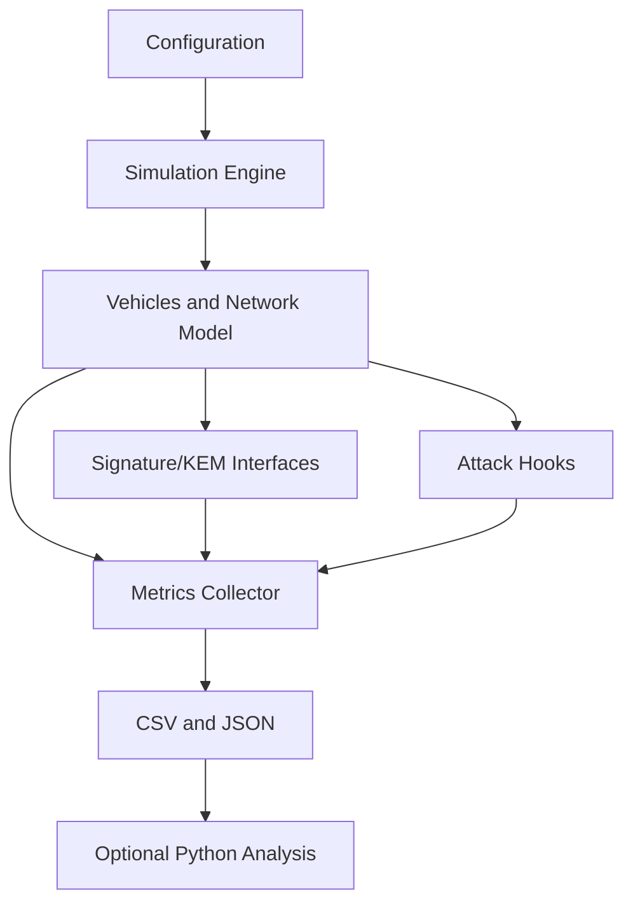

# PQC V2X Research Simulator

A modular C++ simulator for studying post-quantum authentication overhead in V2V and V2I communication. Vehicles generate signed CAM-style BSMs at a configurable rate, move through an abstract 2D environment, transmit to nearby vehicles, and record delivery, authentication, bandwidth, latency, and attack metrics.

## Current implementation

- C++20 project structure with a reusable `v2x_core` library.
- Deterministic experiment seeds and simple YAML-style configuration files.
- Vehicle mobility, communication range, probabilistic loss, latency, and bandwidth metadata.
- CAM message serialization and signature verification workflow.
- Modeled profiles for ML-DSA-44, ML-DSA-65, ML-DSA-87, SLH-DSA-SHA2-128s, Ed25519, ECDSA-P256, SHA-DSA, FALCON-512, FALCON-1024, and ML-KEM family variants.
- Replay and tampering attack hooks.
- CSV and JSON result output.
- Result records include execution type, timeframe, vehicle count, execution/key-generation/encryption/decryption/signing timings, modeled memory usage, forgeability, and network counters.
- Mean, median, standard deviation, and 95% confidence interval utilities.
- KEM interface reserved for ML-KEM/X25519/liboqs implementations.
- CTest smoke tests and a Python CSV analysis helper.

The modeled signature provider is intentionally a deterministic test double. It is useful for network experiments but is not cryptographically secure. The next cryptographic integration should implement the same `SignatureScheme` interface with liboqs and record measured operation timings.

## Build

A C++20 compiler is required by the project configuration. From a Visual Studio Developer PowerShell:

```powershell
cmake -S . -B build
cmake --build build --config Release
ctest --test-dir build -C Release --output-on-failure
```

The executable files are generated in the build output directory, not at the repository root. With the current MSVC/CMake setup, the binaries are created under `build\Release` (or `build\Debug` if you build without `--config Release`).

To confirm the output folder:

```powershell
Get-ChildItem .\build\Release
```

The current machine's legacy GNU compiler only supports older language modes; it was used for compatibility smoke testing, but a newer compiler is required for the declared C++20 CMake build.

## Run

Command-line configuration:

```powershell
# ML-DSA example
.\build\Release\pqc_v2x_simulator.exe --vehicles 50 --duration 60 --range 300 --loss 0.02 --algorithm ML-DSA-44 --seed 42 --csv results_ml_dsa.csv --json results_ml_dsa.json

# SHA-DSA example
.\build\Release\pqc_v2x_simulator.exe --vehicles 50 --duration 60 --range 300 --loss 0.02 --algorithm SHA-DSA --seed 42 --csv results_sha_dsa.csv --json results_sha_dsa.json

# FALCON example
.\build\Release\pqc_v2x_simulator.exe --vehicles 50 --duration 60 --range 300 --loss 0.02 --algorithm FALCON-512 --seed 42 --csv results_falcon.csv --json results_falcon.json

# ML-KEM example
.\build\Release\pqc_v2x_simulator.exe --vehicles 50 --duration 60 --range 300 --loss 0.02 --algorithm ML-KEM-512 --seed 42 --csv results_ml_kem.csv --json results_ml_kem.json
```

Configuration file:

```powershell
.\build\Release\pqc_v2x_simulator.exe --config configs/baseline.yaml --csv results.csv
```

Attack scenario:

```powershell
.\build\Release\pqc_v2x_simulator.exe --config configs/attacks.yaml --replay --tamper
```

Use `--help` for all options.

## Architecture



The network layer depends on cryptographic interfaces, not on liboqs or any particular algorithm. This allows modeled profiles, classical baselines, liboqs-backed implementations, and hybrid schemes to be compared without rewriting the simulator.

## Assumptions and limitations

The channel is an abstract range, loss, latency, and bandwidth model. It is not a replacement for SUMO, Veins, ns-3, OMNeT++, IEEE 802.11p, or C-V2X. Results marked as modeled are not hardware benchmarks. Host CPU and memory behavior should be measured separately with the future benchmark target. Attack modules represent controlled simulation events and do not demonstrate real-world exploitability.

## Planned extensions

1. Implement liboqs-backed ML-KEM and ML-DSA adapters.
2. Add RSU and infrastructure nodes with V2I forwarding.
3. Add KEM session establishment and hybrid KDF composition.
4. Add pseudonym rotation, certificates, Sybil, impersonation, injection, and verification-flood attacks.
5. Add repeated experiment aggregation and raw per-operation samples.
6. Add Google Benchmark crypto benchmarks and richer Python visualizations.
7. Add optional SUMO/Veins/ns-3 integration.
