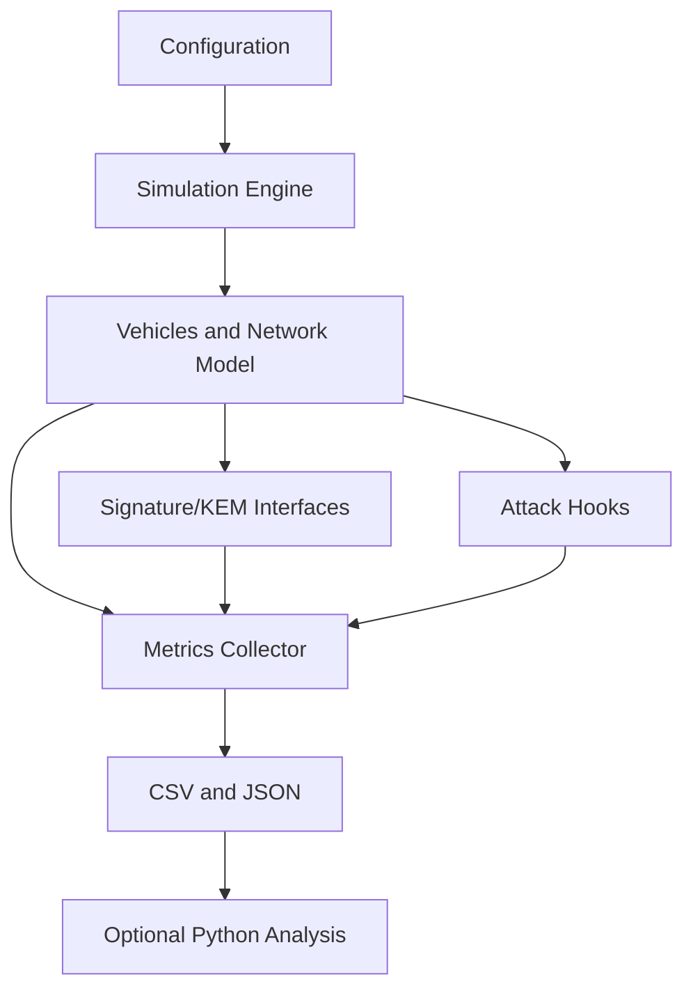

# PQC V2X Research Simulator

A modular C++ simulator for studying post-quantum authentication overhead in V2V and V2I communication. Vehicles generate signed CAM-style BSMs at a configurable rate, move through an abstract 2D environment, transmit to nearby vehicles, and record delivery, authentication, bandwidth, latency, and attack metrics.

## Current implementation

- C++20 project structure with a reusable `v2x_core` library.
- Deterministic experiment seeds and simple YAML-style configuration files.
- Vehicle mobility, communication range, probabilistic loss, latency, and bandwidth metadata.
- CAM message serialization and signature verification workflow.
- Real liboqs-backed signature operations for enabled ML-DSA and Falcon variants, plus the SPHINCS+ SHA2 128s profile.
- SPHINCS+ SHA2 128f is available as a faster-signing alternative to the smaller-signature 128s profile.
- Real liboqs-backed ML-KEM-512/768/1024 key generation, encapsulation, and decapsulation through the KEM interface.
- Optional ML-KEM session establishment between vehicles and the RSU, with handshake timing and ciphertext overhead recorded alongside signed-message metrics.
- Replay and tampering attack hooks.
- CSV and JSON result output.
- Result records include execution type, timeframe, vehicle count, execution/key-generation/signing/verification timings, estimated key/signature memory usage, and network counters.
- Mean, median, standard deviation, and 95% confidence interval utilities.
- CTest smoke tests and a Python CSV analysis helper.

liboqs is fetched at CMake configure time and built with only the signature and KEM algorithms used by this project. Cryptographic keys are generated using liboqs randomness; the simulator seed only controls the network scenario and does not make key generation reproducible. Timings are measured around the actual cryptographic operations. liboqs is intended for research and prototyping, not production protection of sensitive data.

## Build

A C++20 compiler is required by the project configuration. From a Visual Studio Developer PowerShell:

```powershell
cmake -S . -B build
cmake --build build --config Release
ctest --test-dir build -C Release --output-on-failure
```

The executable files are generated in the build output directory, not at the repository root. With the current MSVC/CMake setup, the binaries are created under `build\Release` (or `build\Debug` if you build without `--config Release`).

To confirm the output folder:

```powershell
Get-ChildItem .\build\Release
```

The current machine's legacy GNU compiler only supports older language modes; it was used for compatibility smoke testing, but a newer compiler is required for the declared C++20 CMake build.

## Run

Command-line configuration:

```powershell
# ML-DSA example
.\build\Release\pqc_v2x_simulator.exe --vehicles 50 --duration 60 --range 300 --loss 0.02 --algorithm ML-DSA-44 --seed 42 --csv results_ml_dsa.csv --json results_ml_dsa.json

# FALCON example
.\build\Release\pqc_v2x_simulator.exe --vehicles 50 --duration 60 --range 300 --loss 0.02 --algorithm FALCON-512 --seed 42 --csv results_falcon.csv --json results_falcon.json

# SPHINCS+ speed-oriented profile (larger signatures than 128s)
.\build\Release\pqc_v2x_simulator.exe --vehicles 50 --duration 60 --range 300 --loss 0.02 --algorithm SPHINCS+-SHA2-128f-simple --seed 42 --csv results_sphincs_128f.csv --json results_sphincs_128f.json

# Add ML-KEM-512 session setup to signed-message simulation
.\build\Release\pqc_v2x_simulator.exe --vehicles 50 --duration 60 --range 300 --loss 0.02 --algorithm ML-DSA-44 --kem ML-KEM-512 --seed 42 --csv results_ml_kem.csv --json results_ml_kem.json
```

ML-KEM is configured separately from the message-signing `--algorithm`: it establishes a shared session secret but does not replace message signatures. Each directed vehicle link and each vehicle-to-RSU link establishes one session on its first successful delivery. KEM ciphertext bytes count toward `bytes_on_wire`; public keys are assumed to be provisioned before the simulation.

Configuration file:

```powershell
.\build\Release\pqc_v2x_simulator.exe --config configs/baseline.yaml --csv results.csv
```

Attack scenario:

```powershell
.\build\Release\pqc_v2x_simulator.exe --config configs/attacks.yaml --replay --tamper
```

Use `--help` for all options.

## Architecture



The network layer uses the `SignatureScheme` interface, backed by liboqs for the supported post-quantum signatures. When configured, `KemScheme` establishes per-link ML-KEM sessions and records key generation, encapsulation, decapsulation, and ciphertext overhead.

## Assumptions and limitations

The channel is an abstract range, loss, latency, and bandwidth model. It is not a replacement for SUMO, Veins, ns-3, OMNeT++, IEEE 802.11p, or C-V2X. Results are research measurements from liboqs on the current host and are not representative of vehicle hardware. liboqs names the hash-based profile SPHINCS+; it is not relabeled as the later SLH-DSA standard. Attack modules represent controlled simulation events and do not demonstrate real-world exploitability.

## Planned extensions

1. Add hybrid KDF composition to the KEM session workflow.
2. Add RSU and infrastructure nodes with V2I forwarding.
3. Add KEM session establishment and hybrid KDF composition.
4. Add pseudonym rotation, certificates, Sybil, impersonation, injection, and verification-flood attacks.
5. Add repeated experiment aggregation and raw per-operation samples.
6. Add Google Benchmark crypto benchmarks and richer Python visualizations.
7. Add optional SUMO/Veins/ns-3 integration.
